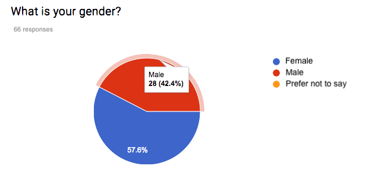
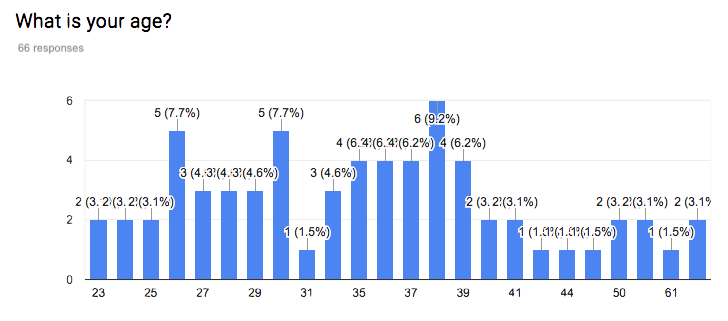
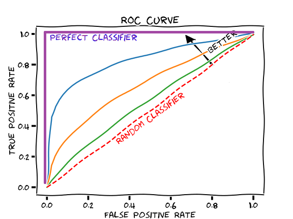

---
#acc-tools:
#  global-toggle: false
#  acc-styles: false
#  code-blocks: false
---

```{r}
#| label: r_global_chunk_settings_and_lib_load
#| eval: true
#| echo: false
#| cache: false

knitr::opts_chunk$set(comment=NA, warning = FALSE)
library(dplyr)
library(tidyr)
library(ggplot2)
library(ROCR)

# Global plot theming, bw with darker gridlines
theme_set(
  theme_bw(base_size = 12) +
  theme(
    panel.grid.major = element_line(colour = "grey85"), # Darker grid lines
    panel.grid.minor = element_line(colour = "grey90") # Darker grid lines
  )
)

# Use global colour palette for discrete colours
options(
  ggplot2.discrete.colour = palette.colors(palette = "R4")
  ) 
update_geom_defaults("point", list(size = 2, color = "#005398"))
```

```{r}
#| label: python-setup-real
#| echo: false
#| 
library(reticulate)
#reticulate::use_python("C:/Python/Python314/python.exe", required = TRUE)
#Sys.getenv("WORKON_HOME")

#These next two lines need to run ONCE on your machine
#reticulate::virtualenv_create("r-quarto")
#reticulate::py_install(c("pandas","seaborn","matplotlib","numpy","statsmodels"), envname = "r-quarto")
reticulate::use_virtualenv("r-quarto", required = TRUE)
```

```{python}
#| label: py-packages-load
#| include: false
import statsmodels.api as sm
import statsmodels.formula.api as smf
```

# Models for binary/binomial response

::::::{.content-hidden}
:::{.Outcomes .unnumbered}

* Recognise the types of data that require a model for binary(ungrouped)/binomial (grouped) response

* Distinguish which type of model, binomial or binary, is appropriate for a given dataset

* Use appropriate plots to explore the relationship between the response and explanatory variables (e.g. boxplots for continuous explanatory variables, and barcharts for categorical explanatory variables)

* Fit a GLM for binary/binomial outcomes using any of the three link functions presented here (logit, probit, complementary log-log)

* Recognise the model being fit from the R code used to fit it

* Interpret logistic regression (logit model) coefficients in terms of the odds of the outcome of interest

* Test hypotheses about regression coefficients using Wald tests and deviances

* Interpret logistic regression output presented in the form of odds ratios

* Check the goodness of fit of a binomial model using the deviance, but only if the fitted values are relatively large (in particular do not use the deviance for goodness of fit of a binary logistic regression model)

* Obtain predicted probabilities and fitted values from a GLM for binary/binomial responses

* Use logistic regression as a classification tool

* Use ROC curves and the area under curve to assess classification performance

* Be aware of the difficulty with trying to predict rare events and the resulting poor classification performance

* Recognise the warnings that separation (perfect prediction) may be occurring in a logistic regression model and be familiar with possible remedies

* Be aware of the issue of overdispersion in logistic regression models

:::
::::::

:::{.Outcomes .unnumbered}

* Identify [binary]{.term} data in [grouped]{.term} and [ungrouped]{.term} formats to model

* Fit a [GLM]{.term} for [binary]{.term}/[binomial]{.term} outcomes

* Recognise a [GLM]{.term} model being fit from the R code used to fit it

* Interpret [logit model]{.term} coefficients in terms of the [odds]{.term} and [odds ratios]{.term} and 

* Test hypotheses and goodness of fit with appropriate methods

* Obtain predicted probabilities and fitted values from a [GLM]{.term} for binary/binomial responses

* Use [logistic regression]{.term} as a classification tool, and evaluate performance

* Develop an awareness of issues with [imbalance]{.term}, [separation]{.term} and [dispersion]{.term}

:::


This chapter we focus on modelling outcomes of interest that take one of two categorical values (e.g. yes/no, success/failure, alive/dead, `1`/`0`). There are two ways that binary responses can be presented as data. Depending on whether there are repeated trials with identical covariates, or not.

The independent responses $Y_i$ can either be

* [Ungrouped]{.term}: each data point takes the value `1` or `0`, typically with probabilities $p_i$ and $1-p_i$ respectively; or

* [Grouped]{.term}: where $Y_i$ is the number of `1`'s in a given number of replicated trials $n_i$. If the probability of each `1` is $p_i$ and the probability of `0` is $1-p_i$. Then $Y_i \overset{indep}\sim \Bin(n_i, p_i)$.

Technically in both cases the distribution of the $Y_i$ is binomial. In the [ungrouped]{.term} case each $Y_i \overset{indep}\sim \Bernoulli(p_i)$, which is the same as the trivial $\Bin(1,p_i)$ (i.e. one trial!). In the [grouped]{.term} case we already saw $Y_i \overset{indep}\sim \Bin(n_i,p_i)$. This explains why this chapter is called [binary/binomial response]{.term} because actually they are essentially the same for the purposes of our modelling and analysis.

## Binary response

We begin with a binary example, sometimes grouping isn't natural so this is just how the data is.

Recall the example from an earlier chapter in which we modelled admission to medical school as a function of the applicant's GPA. That was an example of a [binary logistic regression model]{.term}, in which the outcome of interest is either $Y_i=1$ if the $i$th applicant was admitted to medical school or $Y_i=0$ if the applicant was not admitted. 

The distribution of such a binary response $Y_i$ is assumed to be $\Bin(1,p_i)$ so that $E(Y_i)=p_i$.

The model equation is of the form
$$
g(p_i)=\beta_0+\beta_1 x_i,
$$
where in the example $x_i$ is the $i$th applicant's GPA. In the example we used the logit link, $g(p_i)=\log\left(\dfrac{p_i}{1-p_i}\right)$, but we'll see later in this chapter's notes that additional choices are available. This chapter we will look at models for binary and binomial responses in more detail, starting with a binary logistic regression model for the Yanny-Laurel data.

### Case Study: Yanny or Laurel?

:::{.Video #rvid-vidiNJkAER2ZPg}

## Yanny or Laurel? (3m19s)

<!-- -->

<!--<lite-youtube videoid="iNJkAER2ZPg"></lite-youtube>-->




:::
<!-- end of vid -->

This auditory illusion first appeared on the internet in May 2018. An explanation of why people hear different things can be found in this [short video](https://www.youtube.com/watch?v=yDiXQl7grPQ), just one of many internet sources discussing the phenomenon. The main reason behind the difference appears to be that as we age we lose the ability to hear certain sounds. To see if we could find evidence of such an age effect, we asked people (mainly students on the online MSc programme, and staff and PhD students at the School of Mathematics and Statistics at the University of Glasgow) to fill out a survey on what they hear. Below you can see summaries of the first 66 responses. 

{#fig-yl-pie-heard fig-alt="Pie chart showing breakdown of what respondents heard. Main groups: 43.8% Laurel, 43.8% Yanny" fig-pos="H"}

{#fig-yl-pie-gender fig-alt="Pie chart showing breakdown of respondents' genders. Main groups: 42.4% Male, 57.6 Female" fig-pos="H"}

{#fig-yl-bar-age fig-alt="Bar chart showing age distriubtion of respondents. Range from 23 to 62. Approximately double the frequencies between ages 26 to 39 than outside this range, with some variation." fig-pos="H"}


<!-- old redacted content removed -->

<!-- old redacted content removed -->
<!-- old redacted content removed -->
<!-- old redacted content removed -->
<!-- old redacted content removed -->
<!-- old redacted content removed -->


The proportions hearing "Yanny" and "Laurel" are very similar to each other, and there are some respondents who hear both or even something completely different. This may be because people do not listen to the audio file using the same device, something we couldn't control for in our online survey. Initially we will ignore the responses that list something other than just "Yanny" or just "Laurel", we have 53 observations left. Here are the first few rows of the data:

:::{.panel-tabset}

### R

```{r}
#| label: r-yl-load
yl<- read.csv('https://github.com/UofGAnalyticsData/APM/raw/refs/heads/main/yl53.csv')
head(yl)
yl$hear <- factor(yl$hear, levels = c("Laurel", "Yanny"))

```

### Python

```{python}
#| label: py-yl-load
import pandas as pd
yl_p = pd.read_csv('../resources/data/yl53.csv')
yl_p.head()
```

:::

For exploratory plots we can consider a boxplot for age, the continuous covariate, and a bar chart for gender, the categorical covariate.

```{r}
#| label: fig-r-age-boxplot
#| fig-alt: "Boxplot of respondents' ages grouped by what they heard. Laurel box has higher median, near 38 and wider inter-quartile range, approx 10. Yanny median around 30, with inter-quartile range nearer 8."
#| fig-cap: "Box plot of what people hear, against their age."
yl.plot1 <- ggplot(yl, aes(y=age, x=hear)) +
  geom_boxplot()+ xlab("What do you hear?")

yl.plot1

```

We see in the boxplot that the people who hear "Yanny" are younger on average, but that there is a substantial overlap between the age distributions for the two types of response.

The plot of the proportions against gender is shown below. There is a slightly smaller proportion of men hearing "Yanny", but the proportions look very similar overall.

```{r}
#| label: fig-r-gender-barplot
#| fig-alt: "Bar plots showing proportions heard, split by gender. Both Yanny and Laurel groups approximately 50/50. Further detail in text." 
#| fig-cap: "Illustration of breakdown of name heard by gender."
library(sjPlot)
plot_xtab(yl$hear,yl$gender, show.values = FALSE, show.total = FALSE, 
         axis.labels = c("Laurel", "Yanny"), 
         axis.titles=c("What do you hear?"))
```

Let us look at a [logistic regression model]{.term} with age as the explanatory variable. Here $Y_i=1$ if the $i$th respondent heard "Yanny" and $Y_i=0$ if the $i$th respondent heard "Laurel", with $x_i$ being the respondent's age for $i=1,\dots, 53$. The model we will consider is of the form 
$$
g(p_i)\equiv \log\left(\frac{p_i}{1-p_i} \right)=\beta_0+\beta_1 x_i
$$ {#eq-yl-linear}

:::{.panel-tabset}

### R

and we fit it in R as follows:

```{r}
#| label: r-yl-glm-age-summary
mod.yl <- glm(hear ~ age, family=binomial, data=yl)
summary(mod.yl)

```

### Python

and we fit it in Python as follows:

```{python}
#| label: py-yl-glm-age-summary
mod_yl = smf.glm('hear ~ age', data=yl_p, family=sm.families.Binomial()).fit()
print(mod_yl.summary2())
```

:::

Notice that the age coefficient is negative, which when we look at @eq-yl-linear, is suggesting that older people are less likely to hear "Yanny", but that this coefficient is not significant; the $p$-value of $0.16$ is greater than $0.05$, and so the 95\% confidence interval of $-0.04812\pm 1.96 \times 0.03423=(-0.0115,0.019)$ includes zero. 
Still, if we wanted to use the estimated coefficient to quantify the effect of age, we would need to look at $\exp(-0.04812)=0.953$.

Suppose we consider two people with an age difference of one year, i.e. $x_2-x_1=1$, then
$$
g(p_2)-g(p_1) = \left(\beta_0+\beta_1 x_2\right)- \left(\beta_0+\beta_1 x_1\right) = \beta_1.
$$

So if we write $\mathrm{logodds(p)}$ for $\log\left(\frac{p}{1-p}\right)$, then
$$
\mathrm{logodds}(p_2)-\mathrm{logodds}(p_1) = -0.04812,
$$
alternatively, via exponentiation, 
$$
\frac{p_2}{1-p_2} \div \frac{p_1}{1-p_1} = e^{-0.04812} = 0.953.
$$

This suggests that for two people who differ by one year in age, the older person's odds of hearing "Yanny" are 0.953 times those of the younger person. Or, the other way around, the odds of hearing "Laurel" get multiplied by a factor of $\exp(0.04812)=1.049$. 

For `age` it may make sense to look at wider differences. If we look at a ten-year age difference then $g(p_2)-g(p_1)=10\beta_1$, so the odds multiplier becomes $\exp(0.04812 \times 10)=1.618$, i.e. for two people who differ by ten years in age, the older person's odds of hearing "Laurel" are $1.618$ times those of the younger person.

Finally we can plot the predicted probabilities from this model as a function of age, we see that the predicted probability of hearing "Yanny" decreases with age: (which followed from the sign of our `age` coefficient)

<!-- ```{r} -->
<!-- sjp.glm(mod.yl,type="pred",vars=c("age"),facet.grid = FALSE,  -->
<!--         axis.title=c("Age", "Prob (hear Yanny)"), title="") -->
<!-- ``` -->

<!-- ```{r} -->
<!-- #| label: r-yl-glm-age-predictions -->
<!-- #| fig-alt: "Line plot showing predicted probability of hearing Yanny with age, from the glm model. Shows a steady downward trend from 60% around age 23 to 20% by age 60." -->
<!-- library(sjPlot) -->
<!-- <!-- plot_model(mod.yl,type="pred",terms=c("age"), axis.title=c("Age", "Prob(hear Yanny)"), title="", ci.lvl=NA) -->
<!-- ``` -->

```{r}
#| label: r-yl-glm-age-predictions
#| fig-alt: "Line plot showing predicted probability of hearing Yanny with age, from the glm model. Shows a steady downward trend from 60% around age 23 to 20% by age 60."
yl <- yl |> drop_na()
yl$pred <- predict(mod.yl, type = "response")
head(yl)
ggplot(yl, aes(x = age, y = pred)) +
  geom_point() +
  geom_smooth(color = "blue", linewidth=0.5) +
  labs(
    x = "age (years)",
    y = "Predicted probability of hearing Yanny",
    title = "Model probability predictions of hearing Yanny by age"
  )

```

If we're interested to see how well the predictions actually fit the data, we could plot predicted probabilities (of hearing Yanny) against actual observations like this:

```{r}
#| label: r-yl-glm-age-pred-vs-obs-plot
#| results: hide
p <- ggplot(yl, aes(x = pred,
                    y = as.numeric(hear == "Yanny"))) +
  geom_jitter(alpha = 0.5, height = 0.2, size = 5, 
    shape = 24, stroke = 1, fill = "blue", color = "black"
  ) +
  labs(
    x = "Predicted probability",
    y = "Word heard",
    title = "Observed vs Predicted from the glm"
  )
# + some extra styling
```

```{r}
#| label: fig-r-yl-glm-age-pred-vs-obs-styles
#| echo: FALSE
#| fig-alt: "Graph showing model-predicted probabilities of hearing Yanny against actual observations. Predictions across the range 0.15 to 0.65, with incorrect predictions across the full range. Slight evidence of a small cloud around 0.4 of correct Laurel predictions and a small cloud around 0.55 of correct Yanny predictions, but overall a fairly poor fit."
#| fig-cap: "Scatterplot (with jitter) to show predicted probability of hearing Yanny, against true observations."

p + scale_y_continuous(
    breaks = c(0, 1),
    labels = c("Laurel\n  (0)  ", "Yanny\n  (1)  "),
    expand = expansion(mult = 0.6)
  ) +
  coord_fixed(ratio = 0.05)

```

So we can see the model doesn't fit the data particularly well, with perhaps slight evidence of a slighter denser cloud around $0.4$ and another around $0.6$ of predictions in the correct direction than elsewhere.

In other courses you will discuss how such probability predictions can be used in practice for classification problems. Often a default threshold of $p=0.5$ is used and then classification via $\hat{p} < 0.5 \Rightarrow$`0` and $\hat{p} > 0.5 \Rightarrow$`1` is used, but other approaches also exist.

:::{.Task}

Fit appropriate logistic regression models to explore if gender is related to whether people hear "Yanny" or "Laurel".

:::
<!-- end of Task -->


::::{.Answer}

We can fit a model with just `gender` as a predictor:

```{r}
#| label: r-yl-glm-gender-summary
mod.yl2 <- glm(hear ~ gender, family=binomial, data=yl)
summary(mod.yl2)

```

or we can add `gender` to the model with `age`:

```{r}
#| label: r-yl-glm-gender-age-summary
mod.yl3 <- glm(hear ~ gender+age, family=binomial, data=yl)
summary(mod.yl3)

```
In both cases we see that there is no significant gender effect.

::::
<!-- end of Answer -->


## Binomial response

We now turn our attention to models for binomial responses. As mentioned earlier this typically arises from binary observations where there are duplicates in the covariates, i.e. repetitions of the experiment in some way.

### Case Study: Yanny or Laurel -- revisited

In the Yanny-Laurel example, suppose we created age groups and grouped the responses by gender and age combinations as shown below:

```{r}
#| label: tbl-r-yl-grouped-data-table
#| tbl-cap: "Yanny-Laurel data grouped by gender and age group"
#| echo: FALSE
#| message: TRUE
#| warning: TRUE
# Create age groups
yl <- yl %>%
  mutate(agegroup = cut(age, breaks = c(0, 18, 30, 50, 65, Inf), 
                        labels = c("0-18", "19-30", "31-50", "51-65", "66+")))

# Summarize successes and totals by gender and age group
summary_table <- yl %>%
  group_by(gender, agegroup) %>%
  summarise(
    nYanny = sum(hear=="Yanny"),
    Total = n(),
    .groups = "drop"
  )

# Uncomment this table for PDF
# kable(summary_table, col.names = c("Gender", "Age Group", "No. Yanny Responses", "Total No. Responses"), 
#       caption = "Yanny-Laurel data grouped by gender and age group")

# or use this code for HTML
knitr::kable(summary_table, 
             col.names = c("Gender", "Age Group", "Total Yanny Responses", "Total Responses"),
             format = "markdown", padding = 2)

```

By grouping we have chosen to lose a little granularity of our data. Now instead of presenting multiple identical rows, we group responses that share the same covariate patterns (here we created six gender/age group patterns) and give $y_i$, the number of outcomes of interest (here this is the number of Yanny responses), and $n_i$, the total number of responses for the $i$th covariate pattern. When viewed in this way, each $Y_i$ follows a $\Bin(n_i,p_i)$ distribution and we can still fit a GLM to estimate $p_i$.

Using the ordering or rows above, $\hat{p}_5$ will be our estimated probability that (independently) each man aged between $31$ and $50$ hears "Yanny".

*Note we only have $6$ $y_i$ observations now. Technically there were duplicated covariates in our original data, e.g. four women of age 35 and 3 men of age 30 etc.., so we could have kept single-year age groups and still used a Binomial model, but this more aggressive grouping hopefully makes the approach clearer.*

### Case Study: Beetle mortality data

In this example we will look at a simple binomial model for similarly grouped data, starting with exploratory plots of the data, different choices of link function and hypothesis tests about terms in the model. We will also examine measures of goodness of fit of the model. 

:::{.Video #rvid-vidd2nG7Y17sQw}

## Binomial response models applied to beetle mortality data (9m59s)

<!--
-->

<!-- <lite-youtube videoid="d2nG7Y17sQw"></lite-youtube> -->



:::
<!-- end of vid -->

*Apologies this is a morbid example*

In 1930 as part of trials of chemical treatments for removing beetles from flour harvests experiments were performed to determine how much poisonous gas was needed. These were analysed in a paper by Bliss ([The Calculation of the dosage-mortality curve](https://doi.org/10.1111/j.1744-7348.1935.tb07713.x), Annals of Applied Biology, 1935).

Data for this example consists of the number of dead beetles (`killed`) after five hours exposure to gaseous carbon disulphide at various concentrations (`dose`). The goal for this analysis is to model the probability of a beetle dying as a function of the carbon disulphide dose.

```{r, results = 'hide'}
#| label: r-beetles-load
beetles <- read.csv('https://github.com/UofGAnalyticsData/APM/raw/refs/heads/main/beetles.csv')
beetles
```

```{r, echo = FALSE}
#| label: tbl-r-beetles-table
#| tbl-cap: "Grouped beetle data, by dose level"
knitr::kable(beetles, format = "markdown", padding = 2)
```

Our data has been grouped, for example from the fifth row, we see that $63$ beetles were exposed to a `dose` level of $1.8113$. Of those $63$ we see that $52$ died and thus $11$ survived. As a proportion this means that $\frac{52}{63}\approx 0.855$ died; so from our data if we are going to model that each beetle has a probability of being killed at this `dose` level then our MLE will turn out to be this value, $0.855$. Importantly it's this individual probability of death for each beetle, at the various `dose` levels which will be the the target of our modelling.

Before writing down our model, we can at least visualise the probability of the outcome of interest (beetles killed) by plotting the proportion killed for each dose against the `dose`. We will begin by adding a new column to our data, called `propkilled` representing the proportion killed at that dose level. We see that the proportion killed increases with increasing dose.

```{r}
#| label: fig-r-beetles-propkilled
#| fig-alt: "Scatterplot of raw data in table above (8 points). Showing an S-shaped plot, increasing from around 0.2 at 1.69 on the far left, to 1 at 1.88 on the far right. Increasing with a marked jump around 1.80 in dose level."
#| fig-cap: "Scatterplot of the eight datapoints, of dose against Proportion killed."

beetles$propkilled <- beetles$killed / beetles$number
p1 <- ggplot(beetles, aes(x = dose, y = propkilled)) +
      geom_point(size = 3) + xlab ("Dose") + ylab ("Proportion killed")

p1
```

There are two ways to define our response variable here, either as the result of each beetle's exposure, or for the grouped data. Fundamentally for our modelling it normally makes sense to think of $Y_i$ as each individual beetle experience, so that $Y_i$ is binary, and then each row of @tbl-r-beetles-table represents $n_i$ rows with identical `dose` levels, where $n_i$ is the number of beetles exposed to this dose. For example, the fifth row would be expanded into $63$ individual response rows, each with `dose` of $1.8113$, but then in the `killed` column we have $52$ `1`'s and $11$ `0`'s to represent that of the $63$ rows it contains $52$ examples of dead beetles and $11$ that survived. But when it comes to the later GLM modelling, we will typically want to merge these binary variables into a Binomial.

Our model for $Y_i$ is that $Y_i \overset{indep}\sim \Bernoulli(p_i)$ where $p_i$ is the probability of this particular beetle being killed, at its recorded `dose` level. Our model will be aim to find a formula for $p_i$ in terms of `dose`. As before our model for $p_i$ will use the [logit]{.term} function and a linear component, in particular

$$
g(p_i) = \beta_0 + \beta_1 x_i,
$$
where $g(\blacksquare) = \log\left(\frac{\blacksquare
}{1-\blacksquare}\right)$.

:::{.Supplement}

## On the range of the logit function

We remarked on this earlier, but as helpful repetition here. 

Suppose we want our model to say that $p_i \approx 1$, then taking a little mathematical liberty this means that $\frac{p_i}{1-p_i} \approx +\infty$ and so $\log\left(\frac{p_i}{1-p_i}\right) \approx +\infty$ too.

Conversely, if we wish for $p_i \approx 0$, then $\frac{p_i}{1-p_i} \approx 0$ and so $\log\left(\frac{p_i}{1-p_i}\right) \approx -\infty$.

In the middle, when $p_i \approx 0.5$, then $\frac{p_i}{1-p_i} \approx 1$ and so $\log\left(\frac{p_i}{1-p_i}\right) \approx 0$.

This means that as our linear component $\beta_0 + \beta_1 x_i$ takes values in the range $-\infty$ to $0$ to $\infty$ the predicted $p_i$ values from the model will vary from $0$ to $1/2$ to $1$, respectively. 

This [logit]{.term} function is not the only function with this property, we will see some more later. Importantly having this property means that the full range of possible values of the linear component are all mapped to valid $p_i$ values, unlike if we tried to model $p_i$ directly with a standard linear model.

:::
<!-- end of Supplement -->

Having understood that on a fundamental level our responses $Y_i$ are Bernoulli binary variables, we now return to the grouped interpretation. Let's use $\bar{Y}_i$ for the $i$-th row of our data table, and if we name our columns $n_i=$ the number of beetles, and $\bar{y}_i=$ the number killed, then
$$
\bar{Y}_i \overset{indep}\sim \Bin(n_i, p_i)
$$
becomes our model for the number of `killed` beetles at the $i$-th `dose` level.

The variable $p_i$ has two valid intepretations, it's the probability of an individual beetle being killed, or it's the proportion of beetles at this dose level we expect to be killed. The $n_i$ variables are known, but we aim to fit a model for estimating the $p_i$ values, by `dose` level with a GLM, using our observed group response valued $\bar{y}_i$.

This model can be fitted in R using the `glm()` function as follows:

```{r}
#| label: r-beetles-glm
m1 <- glm(cbind(killed, number-killed) ~ dose, family = binomial(link = 'logit'), 
          data=beetles)
```

Notice that we specify the response as a two-column matrix, the first being the number of successes (`killed`) and the second the number of failures (`number-killed`). That is, the first column is assumed by R to contain the `1`'s and the second the `0`'s for the purposes of direction in later interpretation.

The output is given below:

```{r}
#| label: r-beetles-glm-summary
summary(m1)
```

:::{.Supplement}

## Syntax for calling `glm`

We will get lots of practice of interpreting the output from R, in particular. We just note here that the syntax for calling for a glm model fit involves specifying a `family` parameter, so far in this chapter we have only seen `binomial` (which also covers binary). The default [link function]{.term} is the [logit]{.term} function, so you can omit the `(link = "logit")` and just write `family = binomial` if you wish. Recalling from the introductory lectures, it won't be a surprise to you if we later use `family = poisson` for modelling count responses.

When calling `glm()` you either pass into the left-hand side of the formula a binary `0-1` variable, or you pass a two-column matrix where each row provides the number of successes and failures.

It can be confusing when first seeing this syntax that we are calling it `binomial` and not binary, since really in our modelling we are modelling binary response variables by grouping them. So fundamentally we are modelling binary data, like we did explicitly in the case where we directly pass a `0-1` variable, like in our Yanny-Laurel example. However, since binary data is a special case of binomial data, and the MLE finding GLM method works for binomial random variables (they're in the [exponential family]{.term}!), R just treats both examples as binomial responses as it covers more cases.

:::
<!-- end of Supplement -->

From the `glm()` output we can get the estimates $\hat{\beta}_0=-60.72$ and $\hat{\beta}_1=34.27$ with standard errors 5.18 and 2.91 respectively. As it typical we don't care much about the intercept, but we are interested in whether the `dose` variable is useful in the model.

We can test the hypothesis $H_0: \beta_1=0$ by comparing $z=\frac{\hat{\beta}_1}{\text{se}(\hat{\beta}_1)}=11.77$ with a standard normal distribution. Recall this is called the [Wald test]{.term}. Under $H_0$ our output says the probability of observing this value or an even more extreme one is very small (less than $2\times 10^{-16}$, see the $p$-value in the output), suggesting that it is unlikely that the data came from the model with $\beta_1=0$. In other words, the `dose` coefficient is significant in the model.

Notice that the output also gives us the [Residual deviance]{.term}, taking value $11.232$. This is the actual value of the theoretical concept defined as the [binomial deviance]{.term} in our introductory chapter.

We can use this value and the [null deviance]{.term} value in a likelihood ratio test. Under $H_0: \beta_1=0$, this difference in deviances is a (log-) likelihood ratio test and thus should be have a $\chi^2$-distribution with $(n-1)-(n-p) = p-1$ degrees of freedom. We can also just read the degrees of freedom from the output, we have $7-6=1$. Thus under $H_0$, apparently

$$
284.202 - 11.232 = 272.97
$$
has been drawn from a $\chi^2_1$ distribution. This is incredibly unlikely, since

```{r}
#| label: r-chisq-1-95
qchisq(df=1, p=0.95)
```
 so we once again conclude that including `dose` in the model is worthwhile.

We can also do a [goodness-of-fit test]{.term} to judge how good our model with `dose` is. The value of the [residual deviance]{.term} for this model is $D = 11.23$. If the model is a good fit for the beetle data the deviance should approximately follow the $\chi^2_{8-2}=\chi^2_6$ distribution. The degrees of freedom are determined as the number of distinct covariate patterns in the data (in this case just distinct `doses`, thus 8) minus the number of parameters in the model (`intercept` and `dose coefficient`, thus 2). The 95th percentile of the $\chi^2_6$ distribution is 

```{r}
#| label: r-chisq-6-95
qchisq(df=6, p=0.95)
```

and since $11.23<12.59$, we don't have evidence of lack of fit. However, we have to be careful when using the approximate chi-squared distribution as a measure of goodness of fit, because this approximation relies on having reasonably large fitted values. In particular, we cannot apply this for explicitly binary responses, we need aggregated response values, typically all at least $\geq 5$ in value, as required for $\chi^2$ goodness-of-fit tests.

For our case the grouping of the data yielded nice large cell sizes ($n_i$ values). So we can compare this value to an appropriate $\chi^2$ distribution.

For the logit model the fitted values can be obtained by taking the predicted probabilities, $\hat{p}_i$, and multiplying them by the corresponding total number of beetles for $i=1,\dots,8$:

```{r}
#| label: r-beetles-predictions-df
p.hat <- predict(m1, type="response")
fitted <- beetles$number * p.hat

obs_and_pred <- data.frame(
  Actual = beetles$killed,
  Prediction = round(fitted, 2)
)

print(obs_and_pred)
```

All fitted values with the exception of the first are quite large (as a rule of thumb $>5$ is sufficient), so in this case we can say that the chi-squared approximation seems plausible.

Last **but not least**, the logit model allows for an intuitive interpretation of the coefficient of `dose` in terms of the [odds]{.term} ($\frac{p_i}{1-p_i}$) of 'success'. We usually interpret $\hat{\beta}$ in a logit model by taking $\exp(\hat{\beta})$. For the beetles this would give the [odds ratio]{.term}
$$
\exp(\hat{\beta}_1)=\exp(34.270)=7.643141 \times 10^{14}.
$$

For each unit increase in dose, the odds of being killed get multiplied by this amount. Clearly this is silly here, as the a single unit increase is performing wild extrapolation, so we could instead try a more reasonable $\Delta = 0.1$ change, then we obtain 

$$
\exp(0.1 \times \hat{\beta}_1)=\exp(3.4270) \approx 30.8,
$$
a $30$-times factor increase in the [odds]{.term} from increasing `dose` by $0.1$. This increase is constant across the range, but recall is not a probability. An [odds ratio]{.term} can only be converted into a posterior probability if we also have the prior probability. 

We have used the standard [logit link]{.term} here, which is the most commonly used link for binary/binomial data thanks to this interpretability of the output in evaluating odds of the outcome of interest. 

However, there are situations where another link may also be suitable for a specific application. For instance, here we have what is called a dose-response model in which we look at the response as a function of increasing doses of a toxic substance. In this setting, it may be quite natural to consider the [probit]{.term} link function, 
$$
g(p_i)=\Phi^{-1} (p_i) = \beta_0 +\beta_1 x_i,
$$

where $\Phi$ denotes the cumulative distribution function of the standard normal distribution. As a reminder, here are plots of the probability density function (p.d.f.) and cumulative distribution function (p.d.f.) of the standard normal distribution.

```{r echo=FALSE, fig.height=3.5}
#| label: fig-r-probit-phi-curves
#| fig-cap: "Normal distribution pdf and cumulative density plots"
#| fig-alt: "Simple plots of the standard normal density and standard normal cumulative distributions for illustrative purposes. The cumulative density is similar in shape to the logit function, but with lighter tails."
#| 
par(mfrow = c(1,2))
plot (seq(-3, 3, le=100), dnorm(seq(-3, 3, le=100), mean = 0, sd = 1), type = "l", xlab = "", ylab="Probability density function")
abline (v=0, lty =2)

plot(seq(-3,3,le=100), pnorm(seq(-3,3,le=100), mean = 0, sd = 1), type = "l", lwd =2, xlab = "", ylab="Cumulative distribution function")
abline (h=0.5, lty = 2)
abline (v=0, lty =2)
```

We can also re-parameterize this model as
$$
p_i =  \Phi \left(\frac{x_i-\mu}{\sigma} \right),
$$
where we then define $\beta_0 = -\frac{\mu}{\sigma}$ and $\beta_1 = \frac{1}{\sigma}$.

One reason for such a re-parameterization is that it is known from other experiments what the *median lethal dose* is, namely the dose at which $50\%$ of the beetle survive, is so then under our [probit]{.term} model we know $\mu$ and we just need to estimate $\sigma$. In our [logit]{.term} setup we don't know the `intercept` or the `dose` coefficients, but we now know what $-\beta_0/\beta_1$ needs to equal, which is not so helpful.

To use a [probit link]{.term} in R, is as simple as specifying the link option in the `glm` function to `probit`:

```{r}
#| label: r-beetles-glm-probit-calc-summary
m2 <- glm(cbind(killed, number-killed) ~ dose, family = binomial(link = 'probit'), data=beetles)
summary(m2)
```

From the output we get the estimates $\hat{\beta}_1=-34.93$ and $\hat{\beta}_2=19.72$ with standard errors 2.65 and 1.49 respectively. These differ from the coefficient estimates in the logit model because the model equation is totally different between the two. The interpretation of the coefficients also differs. We are still able to conduct hypothesis tests for the significance of the dose coefficient (small $p$-value, hence significant), and a goodness-of-fit test based on the residual deviance ($D=10.12<12.59$ so no evidence of lack of fit). As the deviance is slightly lower than that of the logit model, we may even say that the fit is better for the probit model, but the difference is rather small.

Finally, a third choice of link that we could consider is the [complementary log-log link]{.term}. In this case the GLM equation is given by

$$
g(p_i)=\log\left(-\log\left(1-p_i\right)\right)=\beta_0 + \beta_1 x_i.
$$

Fitting this model in R is just a matter of specifying the link as follows:

```{r}
#| label: r-beetles-glm-cloglog-calc-summary
m3 <- glm(cbind(killed, number-killed) ~ dose, family = binomial(link = 'cloglog'), data=beetles)
summary(m3)
```

The parameter estimates are $\hat{\beta}_1=-39.57$ and $\hat{\beta}_2=-22.04$ with standard errors 3.24 and 1.80 respectively. The deviance is $D=3.45$ which is quite a bit smaller than the deviances obtained with the other two link functions.

We can plot the fitted curves (on the probability scale) for each of the three regression models as follows:

```{r}
#| label: fig-r-beetles-glm-links-compared-plot
#| fig-cap: "Dose against Proportion Killed, with fitted curves by method."
#| fig-alt: "Plot showing performance of three link functions fit with the raw dose v proportion killed data. Further details in text."
#| code-fold: true

beet_p <- tibble(!!!beetles,
                     logit = fitted(m1),
                     probit = fitted(m2),
                     cloglog = fitted(m3))
p2 <- ggplot(beet_p, aes(x = dose, y = propkilled)) +
      geom_point() + xlab("Dose") + ylab("Proportion killed") +
      geom_line(aes(y = logit, colour = "Logit"), linetype = "solid") +
      geom_line(aes(y = probit, colour = "Probit"), linetype = "dashed") +
      geom_line(aes(y = cloglog, colour = "C log-log"), linetype = "dotted") +
      guides(colour = guide_legend("Method"))
p2
```

We see that all three links give a good fit, with the complementary log-log being the best, although in practice we rarely choose the link based on fit. For one thing, the logit and probit are symmetric and can often be quite similar to each other, and for another, we tend to like the interpretability of the logit link and stick with it most of the time. 

### Choosing a [link function]{.term}

The investigation performed above is not a good general approach to fitting a GLM, we should not go fishing for a [link function]{.term} which somehow gives the lowest deviance. They were presented to show how different functions can be fitted in the same way.

In reality it is the form of the [link function]{.term} and domain knowledge which should shape your decisions. 

+---------------+------------------------------------------------------------------+
| Function name | Formula                                                          |
+:==============+:=================================================================+
| logit         | $g(p) = \log\left(\frac{p}{1-p}\right)$                          |
+---------------+------------------------------------------------------------------+
| probit        | $g(p) = \Phi^{-1}(p)$                                            |
+---------------+------------------------------------------------------------------+
| cloglog       | $g(p) = \log\left(-\log\left(1-p\right)\right)$                  |
+---------------+------------------------------------------------------------------+

: Link functions discussed {#tbl-link-functions .striped tbl-colwidths="[30,70]"}

The [logit]{.term} is the recommended and default one used for [binary]{.term} responses.

The [cloglog link]{.term}, unlike the other two, is not symmetric. Furthermore, its also skew, if you insert $p_i=0.5$ you do not get $0$ like in the other functions. It also has a very slowly decaying tail for small $p$. This means it is good at capturing a range of distinct small $p$ values. 

Thus [cloglog]{.term} is often recommended in extreme value theory, hazard and survival models, when $p$ is often close to zero.

The [probit]{.term} model is known to perform well for dose-response and group-choice scenarios, where central values are more important and there is steep drop-off at the tails. So we should probably have used it for our Beetle data.

### Case Study: The Challenger Disaster

*This case study is mostly tasks for you to get practice*

In January 1986, the [space shuttle Challenger exploded shortly after launch](https://en.wikipedia.org/wiki/Space_Shuttle_Challenger_disaster). It was subsequently found that the rubber O-ring seals in the rocket boosters were susceptible to failing in low temperatures. At the time of the launch the temperature was 31 degrees Fahrenheit. Could the failure of the O-rings have been predicted?
Data from the previous 23 missions shows some evidence of damage on some of the $6$ O-rings on each shuttle, as well as the temperature during the shuttle launch. The data is available from `library(faraway)` and is called `orings`. The first column of the data gives the temperature at launch in degrees F and the second column gives the number of damage incidents out of $6$ possible.

Here are the first few rows of the data:

```{r}
library(faraway)
head(orings)
```

Predictor variable
: $x_i$ the temperature (in degrees F) during launch for the $i$th mission, $i=1,\dots,23$. 

Response variable
: $y_i$ is the number of damaged O-rings (out of 6 total).
  
Model setup
: the probability $p_i$ of individual damage to each O-ring means
$$
Y_i \overset{indep}\sim \text{Bin}(n,p_i)
$$ with $g(p_i)=\beta_0 + \beta_1 x_i$, and here $n=6$.

Here is a plot of the data:

```{r}
#| label: fig-r-oring-data-plot
#| fig-cap: "Scatterplot of the 18 datapoints, of temperature(F) against Proportion of rings damaged."
#| fig-alt: "Scatterplot of raw data for the oring data (18 points). Showing 80% failure at around 52 degrees F, then values around 16% or 0% for most values above 55 degrees. More zeros at higher temps."
p1<- ggplot(orings, aes(x=temp, y=damage/6)) + 
     geom_point()+ xlim (c(25,85)) + ylim(c(0,1)) + 
     xlab ("Temperature (F)") + ylab("Proportion of rings damaged")
p1
```

:::{.Task}

Fit a binomial regression model to the data, trying out the logit, probit and complementary log-log options for the link function. 

:::
<!-- end of Task -->


::::{.Answer}

Logit link:

```{r, results= 'hide'}
lmod <- glm(cbind(damage, 6-damage) ~ temp, family=binomial, data=orings) 
summary(lmod)
```

Probit link:

```{r, results='hide'}

pmod <- glm(cbind(damage, 6-damage) ~ temp, family=binomial(link="probit"), 
            data=orings)
summary(pmod)
```

Complementary log-log link:

```{r, results= 'hide'}
cmod <- glm(cbind(damage, 6-damage) ~ temp, family=binomial(link="cloglog"), data=orings) 
summary(cmod)
```

::::
<!-- end of Answer -->


:::{.Task}

Superimpose the fitted probabilities from each of the three models on the above plot.

:::
<!-- end of Task -->


::::{.Answer}

Here is some code for plotting the three fits.

```{r}
#| label: fig-r-oring-temp-prob-logits
#| fig-cap: "Fitted prediction curves for the three link functions, for the orings data."
#| fig-alt: "Temperature (x) against Probability of damage (y), raw data and predictions from our three link functions. Inverted S-shaped curves, from 1 down to 0 for temperatures from 30F to 80F. All similar, none fit the plotted raw data points very well."
#| fig-pos: "H" # Needed for echo: false to fix latex figure env bug

pred1 <- predict(lmod, newdata=data.frame(temp=seq(25,85,le=23)), type="response")
pred2 <- predict(pmod, newdata=data.frame(temp=seq(25,85,le=23)), type="response")
pred3 <- predict(cmod, newdata=data.frame(temp=seq(25,85,le=23)), type="response")
pred <- data.frame(logit = pred1, probit= pred2, cloglog=pred3, px = seq(25,85,le=23),orings)
p1.1 <- ggplot(pred, aes(x=orings$temp, y= orings$damage/6)) +  
        geom_point(size = 1)+ xlim (c(25,85)) + ylim(c(0,1)) + 
        xlab ("Temperature (F)") + ylab("Probability of damage") +
        geom_line(aes(x = px, y = logit, color = "Logit", linetype = "solid")) +
        geom_line(aes(x = px, y = probit, color = "Probit", linetype = "dashed"))+
        geom_line(aes(x = px, y = cloglog, color = "Complementary log-log", linetype = "dotted")) +
        guides(colour = guide_legend("Link function"), linetype = "none")
p1.1

```

::::
<!-- end of Answer -->

:::{.Task}

Calculate a point estimate of the probability of damage to the O-rings when the temperature is 31 degrees Fahrenheit using each of the three models. 

:::
<!-- end of Task -->


::::{.Answer}

We can obtain the predicted probabilities using the model equation:

```{r}
exp(11.6630-0.2162*31)/(1+exp(11.6630-0.2162*31))
```

We can get the same answer using the `predict()` function as follows: 

```{r}
predict(lmod, newdata=data.frame(temp=31), type="response")
```

Similarly, we can obtain the prediction for the probit model using the cumulative distribution function of a normal distribution:

```{r}
pnorm(5.5915-0.1058*31) 
```

or by using the `predict()` function:

```{r}
predict(pmod, newdata=data.frame(temp=31), type="response")
```

Finally for the complementary log-log model the predicted probability is

```{r}
predict(cmod, newdata=data.frame(temp=31), type="response")
```

The predicted probability of damage is very high for all models.

::::
<!-- end of Answer -->


### Case Study: The Titanic

For our final example, let us look at another famous disaster, the sinking of the Titanic.

:::{.Video #rvid-vidq6gaSm-7sXE}

## A logistic regression model for predicting which of the passengers of the Titanic were more likely to survive (8m04s)

<!--

-->

<!-- <lite-youtube videoid="q6gaSm-7sXE"></lite-youtube> -->



:::
<!-- end of vid -->


On 15th April 1912, during its maiden voyage, the [Titanic](https://en.wikipedia.org/wiki/RMS_Titanic) sank after colliding with an iceberg, killing 1502 out of 2224 passengers and crew. One of the reasons that the shipwreck led to such loss of life was that there were not enough lifeboats for the passengers and crew. Although there was some element of luck involved in surviving the sinking, some groups of people were more likely to survive than others, such as women, children, and the upper-class. 

Our goal is to build a model to predict the survival of a passenger based on information about the passenger's age, gender and ticket class. Here are the first few rows of the data:


```{r}
titanic <- read.csv('https://github.com/UofGAnalyticsData/APM/raw/refs/heads/main/titanic.csv')
titanic$passenger.class <- factor(titanic$passenger.class)
head(titanic)
dim(titanic)
titanic |>
  filter(if_any(everything(), is.na)) %>% 
  nrow()
```

So our dataset contains data on $891$ passengers, and no rows contain data labelled `NA`.

The original dataset this comes from contains a few more columns, but we have already selected a subset.

Our response variable $Y_i$ is the survival status for $n=891$ passengers, taking value 1 for `survived` and 0 for `died`. Predictors include the passenger's ticket class (`passenger.class`), `gender`, `age`, and so on.

We assume that $Y_i \overset{indep}\sim \text{Bin}(1,p_i)$ where $p_i$ is the probability of survival for the $i$th passenger. We fit a logistic regression model of the form $g(p_i)=\log \left(\frac {p_i}{1-p_i}\right)=\textbf{x}^T_i \boldsymbol{\beta}$, where $\textbf{x}_i$ is the vector of covariates for the $i$th passenger.

First, let us look at some exploratory plots:

```{r}
#| label: fig-r-titanic-survival-gender-barplot
#| fig-cap: "Survival rates by gender"
#| fig-alt: "Bar plots showing survival proportions for female and male passengers. Females survived at rate 75%, males at 20%."
#| fig-height: 3.5
#| code-fold: true

totals <- titanic  |> 
  group_by(gender) |> 
  summarise(total = n()) |> 
  mutate(label = paste0("size ", total))

ggplot(titanic, aes(x = gender, fill = factor(survived))) +
  geom_bar(position = "fill") +
  geom_text(data = totals, aes(x = gender, y = 1.05, label = label), 
            inherit.aes = FALSE) +
  scale_y_continuous(labels = scales::percent_format()) + 
  scale_fill_discrete(name = "Survived", labels = c("Died", "Survived")) +
  labs(x = "Gender", y = "Proportion")
```

<!--
```{r}
plot_xtab(titanic$survived,titanic$gender, show.values = FALSE,
         show.total = FALSE, axis.labels = c("Died", "Survived"), 
         legend.title = "Gender") + labs(x = NULL)
```
-->

There is a clear pattern here with the proportion surviving much higher for women than for men.


<!--
```{r}
plot_xtab(titanic$survived,titanic$passenger.class, show.values = FALSE,
         show.total = FALSE, axis.labels = c("Died", "Survived"), 
         legend.title = "Class") + labs(x = NULL)
```
-->

```{r}
#| label: fig-r-titanic-survival-class-barplot
#| fig-cap: "Survival rates by passenger ticket class"
#| fig-alt: "Bar plots showing survival proportions for classes 1, 2 and 3 of passengers. Raw data in table nearby. Clear trend of higher survival for smaller class value."
#| fig-height: 3.5
#| code-fold: true
#| 
totals <- titanic  |> 
  group_by(passenger.class) |> 
  summarise(total = n()) |> 
  mutate(label = paste0("size ", total))

ggplot(titanic, aes(x = passenger.class, fill = factor(survived))) +
  geom_bar(position = "fill") +
  geom_text(data = totals, aes(x = passenger.class, y = 1.05, label = label), 
            inherit.aes = FALSE) +
  scale_y_continuous(labels = scales::percent_format()) + 
  scale_fill_discrete(name = "Survived", labels = c("Died", "Survived")) +
  labs(x = "Passenger Class", y = "Proportion")
```

```{r}
#| label: tbl-r-titanic-class-survival-table
#| echo: false
#| tbl-cap: "Table showing numbers of cases split by passenger class and survival"
class_survival_grid <- table(titanic$passenger.class, titanic$survived)
class_survival_grid <- cbind(paste("Class", 1:3), class_survival_grid)

knitr::kable(class_survival_grid,
             col.names = c("Passenger Class", "Died", "Survived"))
```

We can make various immediate observations, such as that the largest group amongst the passengers who died were third class passengers, while amongst those who survived the largest group was first class passengers. 

---

Now let's fit a model for survival (`survived`) with `age`, `gender` and passenger's ticket class (`passenger.class`) as predictors:

```{r}
#| label: r-titanic-glm-genderclassage
mod.titan <- glm(survived~gender + passenger.class + age,
                 family=binomial(link="logit"), data=titanic)
summary(mod.titan)
```

We see from the output that the coefficient for males is negative, indicating a lower chance of survival for male passengers. Similarly the coefficients for second and third class are negative, with the magnitude of the third class coefficient larger than that of the second class coefficient, suggesting that second class passengers had a worse chance of survival than first class passengers, and that third class passengers had an even worse chance. Finally the age coefficient is also negative, suggesting that older people were less likely to survive.

As a reminder here will be our [systematic component]{.term}: (writing C2, C3 for Class 2 and Class 3)

$$
\log\left( \frac{p_i}{1-p_i} \right) = \beta_0 +\beta_{1}x_{\text{i,male}}+\beta_2x_{\text{i,C2}}+\beta_3x_{\text{i,C3}} + \beta_4x_{\text{i,age}}.
$$ {#eq-titanic-sys-comp}

Recall,
  
  + $x_{i,C2}=1$ means passenger $i$ is in Class $2$,
  + $x_{i,C3}=1$ means passenger $i$ is in Class $3$,
  + if both are zero then passenger $i$ is Class $1$.
  
Similarly, with `gender`, in this case $x_{i,\text{male}}=1$ means passenger $i$ is male.

To quantify the effect of each of these predictors, we look at [odds ratios]{.term} which can be computed as $\exp(\hat{\beta})$. These are shown in the plot below.

<!-- ```{r} -->
<!-- sjp.glm(m1,  vline.color = 5, geom.colors = 4) -->
<!-- ``` -->

```{r}
#| label: r-titanic-glm-genderclassage-oddsratios
#| fig-alt: "Graph from the plot_model function showing odds ratios and confidence intervals for gender-male, class-2, class-3 and age. Values 0.07, 0.33, 0.10 and 0.97 respectively. Further description in text."
plot_model(mod.titan, 
           show.values=TRUE, 
           title = "Odds ratios from GLM predictor coefficients")
```

Here are four interpretations from these odds ratios:

  + men's odds of survival were $0.07$ times those of women;
  + third class passengers' odds of survival were $0.10$ times those of first class passengers;
  + second class passengers' odds of survival were $0.33$ times those of first class passengers; and
  + for each year increase in the passenger's age, the odds of survival decrease (get multiplied by a factor of $0.97$).

Note that the plot also includes confidence intervals for the odds ratios. To illustrate how these are calculated, let's take the coefficient of `gender` as an example:

```{r}
#| label: r-titanic-glm-genderclassage-gendercoeffs
summary(mod.titan)$coefficients["gendermale", ]
```

This is the coefficient for `male` relative to the [base level]{.term} which was `female` for this data. Looking back at @eq-titanic-sys-comp, which we summarise as

$$
\log\left( \frac{p_i}{1-p_i} \right) = \mathbf{x}^T\boldsymbol{\beta},
$$

this means that changing `gender` from `female` to `male` will mean a difference of $-2.61131$ between two [log odds]{.term} values, i.e. 

$$
\begin{aligned}
\log\left( \frac{p_1}{1-p_1} \right) - \log\left( \frac{p_2}{1-p_2} \right) & = \log\left( \frac{p_1}{1-p_1}\div\frac{p_2}{1-p_2} \right), \\
& = -2.61131
\end{aligned}
$$

On this [log odds ratio]{.term} scale an approximate 95\% confidence interval from the `gender` coefficient is:

$$
-2.61131 \pm 1.96 \times 0.18671=(-2.977,-2.245).
$$

Let's go slowly and look at the full details, for this example.

By exponentiating both sides we can find an interval for the [odds ratio]{.term}
$$
e^{-2.977} \leq \frac{p_1}{1-p_1}\div\frac{p_2}{1-p_2} \leq e^{-2.245}.
$$

This interval is

$$
\left(e^{-2.977},e^{-2.245}\right)=\left(0.051,0.106\right).
$$

Thus the [odds ratio]{.term} comparing men to women is between $0.05$ and $0.10$ (the point estimate was $e^{-2.61131} = 0.07$): so our conclusion is that our $95\%$ confidence interval is that 

> the odds of survival for men are between $0.05$ and $0.10$ times the odds for women.

Note, we still aren't talking about specific probabilities, but if we did know the probability of survival of a random woman, we could use the $\frac{q}{1-q}$ formula to find their odds, and then deduce a predicted probability male interval.

---

We can also plot the predicted probabilities of survival against the passenger's age by the passenger's gender and ticket class. We will use the `sjPlot` package in R to shortcut designing our graph, @fig-r-titanic-predprobs-multiway shows pointwise confidence intervals for the predicted probabilities.

<!-- ```{r} -->
<!-- sjp.glm(mod.titan,type="pred",vars=c("age","passenger.class", "gender"), -->
<!--                       facet.grid = FALSE, legend.title = c("Class"),  -->
<!--                       point.alpha = 0.7) -->
<!-- ``` -->

```{r}
#| label: fig-r-titanic-predprobs-multiway
#| fig-alt: "Two scatterplots with best fit curves. One for males and one females. Showing predicted survival probabilities by class from the model. All curves show marked decrease with age in survival rate. Female class performances are all above Class 1 (best) performance for males."
#| fig-cap: "Predictions with confidence intervals by age, class and gender."
plot_model(mod.titan,type="pred",
           terms=c("age","passenger.class", "gender"), 
           title="Predicted survival probabilities by age/gender/class", 
           axis.title = c("Age","Survival probability"),
           colors = palette.colors(palette = "R4"), 
          ) + aes(linetype = group)
```

We see the gender and class differences in survival we have already discussed, and also that survival probabilities decrease by age.

<!-- ```{r, echo = FALSE} -->
<!-- p4 + theme(panel.background = element_rect(fill = "transparent", colour = NA), -->
<!--            plot.background = element_rect(fill = "transparent", colour = NA), -->
<!--            panel.border = element_rect(fill = NA, colour = "black", size = 1),  -->
<!--            legend.background = element_rect(fill = "transparent", colour = NA)) -->
<!-- ``` -->

## Probabilities, odds, odds multipliers and odds ratios

In [logit]{.term} models, we interpret coefficients in terms of the [odds]{.term}, and terms involving the word "odds" inevitably come up when describing the model fit. Here we present all of these terms in the same place and describe the relationships between them.

:::{.Definition #rdef-odds}

### Odds and Log-Odds

The [odds]{.term} are defined as
$$
\text{Odds}=\frac{p}{1-p}
$$
where $p$ is the probability of the outcome of interest.

We can express the probability in terms of the odds by rearranging this equation to 
$$
p = \frac{\text{Odds}}{\text{Odds}+1}.
$$ {#eq-odds-def}

The [log odds]{.term} (sometimes written LO) is merely the logarithm of the [odds]{.term}, so
$$
\text{LO} = \log\left(\text{Odds}\right) =\log\left(\frac{p}{1-p}\right).
$$ {#eq-logodds-def}

:::
<!-- end of Definition -->

Note that in [logistic models]{.term} it's the [log odds]{.term} from @eq-logodds-def which is being modelled directly as the [linear component]{.term}. Recall that across all observations, we are looking for maximum likelihood estimates for the $\boldsymbol{\beta}$ in

$$
\log\left(\frac{p_i}{1-p_i}\right) = \textbf{x}^T_i \boldsymbol{\beta}, \quad i=1,\ldots,n.
$$

> **Warning**: The $\beta$ coefficients will be [log odds ratios]{.term}.

Suppose we have a predictor with two levels, say `gender` in the Titanic example, which is coded `1` for men and `0` for women. This means the overall value of the [linear component]{.term} will be larger by $\beta_{\text{male}}$ for a man than for a woman (lower if $\beta_{\text{male}}<0$).

This means that the gender coefficient is the difference between

  + $\log\left(\text{Odds}_1\right)=\log\left(\frac{p_1}{1-p_1}\right)$ (the log odds for men) and 
  + $\log\left(\text{Odds}_0\right)=\log\left(\frac{p_0}{1-p_0}\right)$ (the log odds for women). 

And since, by log laws, $\log\left(\text{Odds}_1\right)-\log\left(\text{Odds}_0\right)=\log\left(\dfrac{\text{Odds}_1}{\text{Odds}_0}\right)$, the `gender` coefficient is equal to the log odds ratio: 
$$
\beta_{\text{male}}=\log\left(\dfrac{\text{Odds}_1}{\text{Odds}_0}\right)=\log \left( \dfrac{\frac{p_1}{1-p_1}}{\frac{p_0}{1-p_0}}\right).
$$

By exponentiating both sides we see that $\exp(\beta)$ is the [odds ratio]{.term} for comparing the two levels of the predictor (here men and women) in terms of the [odds]{.term} of the outcome of interest.

And since we can express this as $\text{Odds}_1=\exp(\beta) \times \text{Odds}_0,$ we also call $\exp(\beta)$ the [odds multiplier]{.term}.

If the explanatory variable $x$ in the model is continuous rather than a factor, the odds multiplier gives the effect of an increase of one unit in $x$ on the odds of the outcome of interest.

For the Titanic example, a year increase in `age` is associated with multiplying the odds of survival by a factor of $\exp(-0.03330)=0.97$, perhaps more usefully we can consider a ten-year increase in `age` being associated with a $\exp(10\times -0.03330)=0.717$ [odds multipler]{.term}.

The following video, in which Prof. David Spiegelhalter talks about odds ratios and their interpretation, may be of further use in clarifying these concepts.

:::{.Video #rvid-vidixKhS0Silb4}

## Prof. David Spiegelhalter on odds ratios. (7m03s)

<!--

-->

<!-- <lite-youtube videoid="ixKhS0Silb4"></lite-youtube> -->



:::
<!-- end of vid -->

## Model checking and diagnostics for logistic regression

In our theoretical GLM introduction we saw that the deviance, $D$, is one possible goodness-of-fit statistic for GLMs. Here's a reminder

:::{.Definition .unnumbered}

## Deviance (reminder)

The [deviance]{.term}, $D$, is defined as 
$$
D=2\log \lambda =2\left[ l(\hat{\boldsymbol{\beta}}_{\max};\boldsymbol{y})-l(\hat{\boldsymbol{\beta}};\boldsymbol{y})\right]
$$
where $l(\hat{\boldsymbol{\beta}}_{\max};\boldsymbol{y})$ is the maximised log-likelihood for the [saturated]{.term} model and $l(\hat{\boldsymbol{\beta}};\boldsymbol{y})$ is the maximised log-likelihood for the model of interest.
:::
<!-- end of Definition -->

A second [goodness-of-fit]{.term} measure is the [Pearson chi-squared statistic]{.term}.


:::{.Definition}

## Pearson's chi-squared statistic

[Pearson's chi-squared statistic]{.term} is defined as
$$
X^2= \sum_{i=1}^n \frac{(y_i-n_i\hat{p}_i)^2}{n_i\hat{p}_i(1-\hat{p}_i)},\quad i=1,\dots,n
$$
where

  + $y_i$ represents the observed number of successes, 
  + $n_i$ is the number of trials, and 
  + $\hat{p}_i$ the fitted probabilities for the $i$th covariate pattern.

:::
<!-- end of Definition -->


:::{.Theorem}

## Sampling/asymptotic distribution of $X^2$

$X^2$ is asymptotically equivalent to the deviance. Therefore, under 
$$
H_0: \text{the model fits the data well},
$$
$X^2$ is approximately distributed as $\chi^2_{n-p}$ where $n$ is the number of parameters in the saturated model (usually equal to the number of observations), and $p$ is the number of parameters in the model of interest. This results holds for relatively large fitted values.
:::
<!-- end of Theorem -->

<!-- ###[video, videoid="_Gf9eH7C1UM", duration="4m41s"] Pearson's goodness of fit statistic -->

:::{.Example}

## Beetle data, revisited

Suppose that we would like to assess the fit of the logistic model in the beetle mortality case study seen earlier. The data and fitted values obtained from the logit model were as follows.

<!-- old redacted content removed -->

<!-- old redacted content removed -->
<!-- old redacted content removed -->
<!-- old redacted content removed -->
<!-- old redacted content removed -->
<!-- old redacted content removed -->
<!-- old redacted content removed -->
<!-- old redacted content removed -->
<!-- old redacted content removed -->
<!-- old redacted content removed -->
<!-- old redacted content removed -->
<!-- old redacted content removed -->
<!-- old redacted content removed -->
<!-- old redacted content removed -->
<!-- old redacted content removed -->
<!-- old redacted content removed -->
<!-- old redacted content removed -->


|$x_i$   |  $n_i$ | $y_i$ | $\hat{y}_i=n_i \hat{p}_i$|
|--------|--------|-------|--------------------------|
| 1.6907 |    59  |    6  | 3.46  |
| 1.7242 |    60  |   13  | 9.84  |
| 1.7552 |    62  |   18  | 22.45 |
| 1.7842 |    56  |   28  | 33.90 |
| 1.8113 |    63  |   52  | 50.10 |
| 1.8369 |    59  |   53  | 53.29 |
| 1.8610 |    62  |   61  | 59.22 |
| 1.8839 |    60  |   60  | 58.74 |

: Original Beetle data, plus fitted predictions {#tbl-beetle-plus-preds .striped}

We wish to test 
$$
H_0: \text{the model fits the data well}
$$
against 
$$
H_1: \text{the model does not fit the data well}
$$

We can view the following sum as either a weighted sum of squares (note the denominator is why we say weighted),
$$
S_w = \sum_{i=1}^n \frac{(y_i-n_ip_i)^2}{n_ip_i(1-p_i)}
$$
or we can just see this as $X^2$. It turns out that using the MLE approach to find $\hat{p}_i$ is equivalent to minimizing this $S_w$ expression.
 
When $X^2$ is evaluated at the estimated expected frequencies, the statistic is
$$
X^2= \sum_{i=1}^n \frac{(y_i-n_i\hat{p}_i)^2}{n_i\hat{p}_i(1-\hat{p}_i)}
$$

which will be approximately $\chi^2_{n-p}$ if the model is correct.

For the beetle mortality example, $D=11.23$ and $X^2=10.03$. Both are large, but not surprisingly so, compared with a $\chi^2_6$ distribution. The 95th percentile of the $\chi^2_6$ distribution is above both values:

```{r}
#| label: r-qchisq-calc-df6
qchisq(p=0.95, df=6)
```

Therefore there is no evidence of lack of fit for the logit model.
:::
<!-- end of Example -->


**Note:** The chi-squared approximation for the deviance and $X^2$ rely on having expected frequencies (fitted values) that are not too small. It should be ok to use for checking the fit of the beetle mortality model, but if each observation has a different covariate pattern such as that $y_i$ is either 0 or 1, as in the Yanny-Laurel example, then the $\chi^2$ approximation theory isn't valid and neither $D$ nor $X^2$ provide a useful measure of goodness of fit. For this reason, a modification of the chi-squared test has been proposed...

### Hosmer-Lemeshow goodness of fit test

Simply, this method proposes merging similar fitted values into groups, after fitting the model. The aim is that no group has a small expected size, allowing a $\chi^2$ approximation to be used for goodness-of-fit purposes.

Suppose that for a model for [binary responses]{.term} we wish to test
$$
H_0: \text{the model fits the data well}
$$ 
i.e. observed and expected response frequencies are close to each other, versus 
$$
H_1: \text{the model is not a good fit for the data}
$$
i.e. observed frequencies are far from expected frequencies. 

:::{.Definition #rdef-hosmerlemeshow}

### The Hosmer-Lemeshow method

The [Hosmer-Lemeshow test statistic]{.term} is calculated as follows:

1. Order the fitted values.
2. Group the fitted values into $g$ classes (typically we use $g$ between $6$ and $10$) of roughly equal size.
3. Calculate the observed and expected number in each group
4. Perform a chi-squared goodness-of-fit test, with $\chi^2_{g-2}$ as the reference distribution.

:::
<!-- end of Definition -->

<!-- ###[video, videoid="a_fQkJvC7TY", duration="4m08s"] Hosmer-Lemeshow test -->


:::{.Example}

## Yanny-Laurel revisited


Returning to the Yanny-Laurel example we saw earlier, let's have a look at the goodness of fit of the binary logistic regression model predicting the probability of hearing "Yanny" as a function of the age of the participant.

We will use a pre-built an implementation of the Hosmer-Lemeshow test to check for evidence of lack of fit in the model.

```{r}
#| label: r-hoslem-old
#| include: false
#| warning: true
source(url("http://www.chrisbilder.com/categorical/Chapter5/AllGOFTests.R"))
HLTest(mod.yl, g=10)
```

```{r}
#| label: r-hoslem-new-10

library(generalhoslem)
numeric_obs <- as.numeric(yl$hear == "Yanny")
yl_hoslem_10 <- logitgof(numeric_obs, yl$pred, g=10)
cbind(yl_hoslem_10$observed, yl_hoslem_10$expected)
```

Notice that with $10$ groups the bins not only contain some bins of size under $5$, but all of them are! So this is too many groups. Our dataset is very small for this test, and we need to go down to around $g=4$ to ensure bins are all at least $5$ (approximately).

```{r}
#| label: r-hoslem-new-4
yl_hoslem_4 <- logitgof(numeric_obs, yl$pred, g=4)
cbind(yl_hoslem_4$observed, yl_hoslem_4$expected)
yl_hoslem_4
```

At $g=4$ we have so few bins that the power of this test is getting pretty weak. Our large $p$-value indicates no particular lack of fit. 

There are other tests that have since been developed, and perhaps some of those would actually be better suited in this example (but not covered in this course).

:::
<!-- end of Example -->


Notes on the Hosmer-Lemeshow test:

  + Failing to reject $H_0$ does not mean that the fit is good. 
  + The power of the test can be too small to detect lack of fit.
  + How the fitted values are grouped together matters -- use different values of $g$ and see if that changes the conclusion.
  + Our preference would be for a large $g$, which still keeps bin sizes large.
  + Other tests have been developed since the Hosmer-Lemeshow test, which are perhaps better
    
<!-- old redacted content removed -->

### Likelihood ratio chi-squared statistic

The [likelihood ratio chi-squared statistic]{.term} is defined as twice the difference in maximised log-likelihood under the model of interest and under the null (minimal) model.  

  + Under the [null model]{.term} we pick a single value $\tilde{p}=\sum y_i/\sum n_i$.
  + Under our model of interest we let $\hat{p}$ be the MLE.
  
Then
$$
C=2 \left[l\left(\hat{\mathbf{p}};\mathbf{y}\right)-l\left(\tilde{\mathbf{p}},\mathbf{y}\right)\right]
$$
should be approximately $\chi^2_{p-1}$ if all the $p$ parameters except the intercept $\beta_0$ are zero. 

We have already used this in models of the form $g(\mu)=\beta_0+\beta_1 x$ with null hypothesis: $\beta_1=0$.

:::{.Key .unnumbered}

We can also use [likelihood ratio statistics]{.term} in model selection, if those models are [nested]{.term} (i.e. one is a special case of another). Then we can subtract their log-likelihoods and compare to the a $\chi^2$ with degrees of freedom equal to the difference in number of parameters being estimated.

:::

### AIC and BIC

The [Akaike information criterion (AIC)]{.term} and the [Schwartz]{.term} or [Bayesian information criterion]{.term} (BIC) are other goodness-of-fit statistics based on the log-likelihood function with adjustment for the number, $p$, of parameters estimated. You will have met these before in the study of linear models.

| Criterion Name | Formula |
|----------------|----------|
| AIC | $-2l\left(\hat{\mathbf{p}};\mathbf{y}\right) + 2p$ |
| BIC | $-2l\left(\hat{\mathbf{p}};\mathbf{y}\right) + 2p \times \log(\text{number of observations})$ |

: {tbl-colwidths="[30,70]"}

Note that the R output we saw earlier reported the [AIC]{.term} value in the `summary()` command. R doesn't routinely also return the exact [likelihood]{.term} or [log-likelihood]{.term}, but we could calculate it with the [AIC]{.term} formula, since we know $p$ as well.

The largest likelihood values will contribute to large negative values of these criteria (unless $p$ is very large). So it's small value of these statistics which indicate that there is no lack of fit in the model. These statistics could be (and are!) used as model selection criteria, especially when the models under comparison are [not nested]{.term}.

:::{.Key .unnumbered}

[AIC]{.term} is more heavily used, and it provides us a way to compare two models which are not nested, with respect to some criterion. It is still a relatively arbitrary way to penalize overfitting by way of adding $+2p$, but it is known to work well.

:::

### Residuals

There are two main forms of residuals for logistic regression: [deviance]{.term} and [Pearson]{.term} (or [chi-squared]{.term}) residuals. These are the contributions to $D$ and $X^2$ respectively from each distinct covariate pattern.

Suppose there are $m$ distinct covariate patterns and that $Y_k$, $n_k$ and $\hat{p}_k$ are the number of successes, the number of trials and the estimated probability of success for the $k$th covariate pattern, where $k=1,2,\ldots,m$. We didn't actually need to group identical covariate patterns, but it can make sense in later residual comparisons.

:::{.Definition #rdef--pearson-residuals}

### Pearson residuals

The [Pearson]{.term} or [chi-squared residual]{.term} is
$$
X_k=\frac{y_k-n_k \hat{p}_k}{\sqrt{n_k\hat{p}_k(1-\hat{p}_k)}}.
$$

The [standardised Pearson residual]{.term} is 
$$
r_{Pk}=\frac{X_k}{\sqrt{1-h_k}},
$$ where $h_k$ is the leverage which is obtained from the hat matrix.

:::
<!-- end of Definition -->


:::{.Definition #rdef-deviance-residuals}

## Deviance residuals

The deviance residual is

$$
\begin{aligned}
d_k &=\text{sign}(y_k-n_k \hat{p}_k) \\
& \times
\left \lbrace 2 \left[ y_k \log \left( \frac{y_k}{n_k \hat{p}_k}\right)+(n_k-y_k) \log \left( \frac{n_k-y_k}{n_k-n_k\hat{p}_k}\right) \right]\right \rbrace^{1/2}.
\end{aligned}
$$


The standardised deviance residual is
$$
r_{Dk}=\frac{d_k}{\sqrt{1-h_k}}.
$$

:::
<!-- end of Definition -->


The residuals can be plotted against continuous covariates to check the linearity assumption, and in the order of the measurements to check for serial correlation. Normal probability plots could also be used as the residuals should be approximately $N(0,1)$ provided the numbers of observations for each covariate pattern are not too small. 

However, the residuals are not informative if the response is binary of if $n_k$ is small for most covariate patterns. So residual plots wouldn't be that useful for the Yanny-Laurel data where the outcome variable is binary and the predictor (age) is continuous, but they could be used for the beetle data.

As in linear regression, the [leverage]{.term} of individual observations plays a role here too. Recall that high leverage points will typically exhibit lower residual values as the model is essentially trying harder to fit these points, since there are larger penalties for missing. Thus the denominators in the definitions, using the [leverage]{.term} values -- as in linear regression -- accounts for this effect. These [standardized residuals]{.term} then become comparable with each other, and under correct models are approximately $\sim N(0,1)$. Thus plots of all [standardized residuals]{.term} against covariate value can be used to identify outliers or poorly fitting observations.

:::{.Task}

Compare the residual plots from the Yanny-Laurel model with those from the logit model used for the beetle data.

:::
<!-- end of Task -->


::::{.Answer}


Residual plots for the Yanny-Laurel model:

```{r}
#| label: fig-r-yl-deviance-residuals
#| fig-cap: "Deviance residual plot, against predicted probability for the Yanny-Laurel data."
#| fig-alt: "Deviance residual plot, against predicted probability for the Yanny-Laurel data. Two obvious sloped parallel lines of scatter points, as expected, corresponding to 0 and 1 predictions."
dres.yl <- resid(mod.yl, type="deviance") # Deviance residuals
pres.yl <- resid(mod.yl, type="pearson") # Pearson residuals
pred.yl <- predict(mod.yl, type="response") # Fitted probabilities
d.yl <- data.frame(pred.yl=pred.yl,dres.yl=dres.yl, pres.yl=pres.yl)

ggplot(d.yl, aes(x = pred.yl, y = dres.yl)) +   geom_point() +
  xlab("Predicted probability") + ylab("Deviance residual")

```

and for the beetles logit model:

```{r}
#| label: fig-r-beetles-deviance-residuals
#| fig-cap: "Deviance residual plot, against predicted probability for the Beetles data."
#| fig-alt: "Deviance residual plot, against predicted probability for the Beetles data. A random scattering of points around 0."
m1.b <- glm(cbind(killed, number-killed) ~ dose, family = binomial(link = 'logit'), 
            data=beetles)
dres.b <- resid(m1.b, type="deviance")
pres.b <- resid(m1.b, type="pearson")
pred.b <- predict(m1.b)

d.b <- data.frame(pred.b=pred.b,dres.b=dres.b, pres.b=pres.b)

ggplot(d.b, aes(x = pred.b, y = dres.b)) +   geom_point() +
  xlab("Predicted probability") + ylab("Deviance residual")

```

We can see that the beetle model residuals scatter around zero in a similar way to a linear regression model, while for the Yanny-Laurel model they follow a distinct pattern.

::::
<!-- end of Answer -->


## Logistic regression as a classifier

<!-- You have already had an introduction to using logistic regression for classification in Predictive Modelling.  -->

Suppose that we have data $y_i$ taking the value `1` for Class A and `0` for Class B, and that we have built a [logistic regression model]{.term} predicting $p_i=P(Y_i=1)$ as a function of a number of available explanatory variables.

To classify an observation into one of the two classes using such a [logistic regression model]{.term}, we can choose a value $c$ and then use a [decision rule]{.term} such as 

  + if $\hat{p}_i \geq c$ the $i$th observation gets classified into Class A, and 
  + into Class B otherwise.
  
The constant $c$ is the [decision threshold]{.term}, and it is typically set at $0.5$. For example, if the model predicts a probability of $0.7$ for an observation, and the threshold is $0.5$, we would classify that observation as belonging to Class A. Conversely, a predicted probability of $0.2$ would result in a classification into Class B.

We can adjust the threshold depending on the specifics of the application. A higher threshold would lead to fewer false positives but more false negatives, and vice versa. There is a trade-off to consider here, and the choice is often made based on the cost associated with each type of error. Datasets with [class imbalance]{.term} are the typical real-world situation where thresholds need to be thought more deeply about.

One way to assess the predictive power of a model and to come up with an "optimal" decision threshold, is to look at the [receiver operating characteristic]{.term} ([ROC]{.term}) curve. The curve is created by evaluating the performance of the classifier as we vary the threshold $c$ from $0$ (where everything gets classified as Class A) to $1$ (where everything is classified as Class B).

{#fig-roc-curve-cartoon fig-alt="Illustration of what a ROC curve looks like. Showing a perfect classifier is like an inverted L, a random classifier a slope 1 y=x line, with better classifier curves in between." fig-pos="H"}

*Image: [Courtesy of Rachael Draelos](https://glassboxmedicine.com) and originally [Martin Thoma](https://commons.wikimedia.org/wiki/User:MartinThoma)*

Using the proportion of positive data points that are correctly predicted as positive (true positive rate) and the proportion of negative data points that are incorrectly predicted as positive (false positive rate), one can generate a graph that shows the trade-off between the rate at which the model predicts the response correctly versus predicting it incorrectly. On the horizontal axis of the [ROC]{.term} curve we have the false positive rate and on the  vertical axis the true positive rate. The area under the [ROC]{.term} curve, known as [AUC]{.term} (area under curve) or more typically [AUROC]{.term}, is used as a measure of a diagnostic test’s discriminatory power. An [AUROC]{.term} value of $0.5$ indicates that the predictive model is of no discriminative value, this is the score we would expect from classifying by just tossing a fair coin repeatedly.

We would like models to perform better than a random guess, so we would like the [AUROC]{.term} to be greater than $0.5$. We can also compare the [ROC]{.term} curves for different models to help us choose between them. 

:::{.Example}

Here is one way to produce the ROC curve and AUC for the model fitted to the Titanic data:
 
```{r}
#| label: fig-r-auc-roc-pROC
#| fig-cap: "ROC curve for Titanic survival prediction model fitted."
#| fig-alt: "Moderately good ROC curve, steep increase from bottom left, and flattening off towards the top right. Overall area of 0.848 illustrating good performance."
 
library(pROC)

titanic$Prid <- predict(mod.titan, titanic, type = "response")
roc_obj <- roc(titanic$survived, titanic$Prid)
auc_value <- auc(roc_obj)

# Neat ggroc function provided by pROC package
ggroc(roc_obj, color = "#005398") +
  xlab("False Positive Rate") +
  ylab("True Positive Rate") +
  ggtitle(paste("Area under the ROC curve =", round(auc_value,3)))
```

The area under the curve is about `r round(auc_value,2)`, which is reasonable considering that we have only used three of the predictors available in the data. 

We can also change the decision threshold according to some criterion. Let's say that we want to keep the false positive rate lower than 20%, in other words we don't want to incorrectly predict that a passenger survived with a probability of more than $0.2$. 

In creating the [ROC]{.term} curve our code will already have found the [False Positive Rate]{.term} (FPR) and [True Positive Rate]{.term} (TPR) for a fine grid of possible thresholds from $0$ to $1$, so they have already been calculated, we just need the correct syntax to read them.

In the case of the `pRoC` package we can access them via `$thresholds` like this:

```{r}
#| label: tbl-r-titanic-roc-cutoff
#| tbl-cap: "Lowest cutoff thresholds with FPR under 20%"
cutoffs <- tibble(
  cut = roc_obj$thresholds,
  TPR = roc_obj$sensitivities,
  FPR = 1 - roc_obj$specificities
)

cutoffs |> 
  filter(FPR < 0.2) |>
  slice_head(n = 6) |> 
  knitr::kable(format = "markdown")
```

:::
<!-- end of Example -->


Note that `library(pROC)` is just one package that produces ROC curves. Other recent packages include `library(plotROC)` or `library(ROCit)`.

As a final note, there is a lot more that one can do with the Titanic dataset. We have only used three explanatory variables and one could try to improve predictive performance by adding more terms to the model. In fact there is a [prediction competition](https://www.kaggle.com/c/titanic) on this dataset, with the data we've used as the training set and also a test set available on which the predictions are made. This is why the set we have worked with is smaller than those who have seen the set before were expecting, as this was just a training set.

:::{.Example}

### Possum classification

This data set records variables of common brushtail possums found in various Australian regions (Source: [OpenIntro Statistics](https://www.openintro.org/data/)). We consider 104 brushtail possums from two regions in Australia, where the possums may be considered a random sample from the population. 

{fig-alt="Photo of a Common Brushtail Possum sitting in a tree.".lightbox}

*Image: [Photo by Andrew Mercer](http://www.baldwhiteguy.co.nz/)*

The first region is Victoria, which is in the eastern half of Australia and traverses the southern coast. The second region consists of New South Wales and Queensland, which make up eastern and northeastern Australia. The outcome variable, called `pop`, takes value `Vic` or `Other` when a possum is from Victoria or not.

In this example, we want to demonstrate how to build a model that differentiates between the possums in Victoria and from those outside Victoria, based on the variables provided.



```{r}
#| label: tbl-r-possum-data-table
#| echo: false
#| tbl-cap: First few rows of Possum data
possum <- read.table('data/possum.txt', header = TRUE)
knitr::kable(head(possum), format = "markdown", padding = 2) 
```

We can explore the relationships between the variables by looking at plots:

```{r}
#| label: fig-r-possum-ggpairs
#| fig-alt: "An all-pairs plot for the Possum data. Showing all 36 paired plots of data comparisons. Too much detail for alt-text description."
#| fig-cap: "An all-pairs plot for the Possum data"
#| code-fold: show

library(GGally)
p4<- ggpairs(possum, columns = c(3,4,5,6,7,8), columnLabels = c("Sex", " Age", "Head length", "Skull width", "Total length", "Tail length"), aes(colour = pop, alpha = 0.4), upper = list(continuous = wrap("cor", size = 2)))
p4
```

We can use logistic regression to classify the possums in the two regions. We use `population` as the outcome variable and five predictors: `sexm` (an indicator for a possum being male), `head_length`, `skull_width`, `total_length`, and `tail_length`. The full logistic regression model and a reduced model after variable selection are summarized in the table.


```{r}
#| label: r-possum-convert-pop-to-binary
#| include: false
population <- 0 
population[possum$pop == "Vic"] <- 1
population[possum$pop == "other"] <- 0
```

```{r}
#| label: r-possum-glm-summary-full
m1 <- glm(population ~ sex + headL + skullW + totalL + tailL, family = binomial, data = possum)
summary(m1)
```

In model `m1` we can see that `head_length` and `skull_width` are not significant predictors (p-values $> 0.05$), which means we can probably simplify it by dropping these variables. We drop `headL` first.


```{r}
#| label: r-possum-glm-summary-dropped-headL
m2 <- glm(population ~ sex  + skullW + totalL + tailL, family = binomial, data = possum)
summary(m2)
```


We now actually do not drop any more variables, by the $p-value$ criterion method.

Based on the summary for model `m2` we can write the equation as follows:

$$
\begin{aligned}
\log\left(\frac{\hat{p}} {1-\hat{p}}\right)  = 33.51 & - 1.421 \times \text {sex-male} -0.279 \times \text{skull-width } + \\
& + 0.569 \times \text{total-length} - 1.806 \times \text{tail-length},
\end{aligned}
$$
where $p$ denotes the proportion of possums from Victoria.
Using this equation, we can calculate the probability that a particular male possum with its skull about 63mm wide, its tail 37cm long, and its total length of 83cm comes from the Victoria area of Australia:

$$
\begin{aligned}
\log\left(\frac{\hat{p}} {1-\hat{p}}\right) & = 33.51 - 1.421 \times 1 -0.279 \times 63\; + \qquad   \\ 
& \hfill + 0.569 \times 83\ - 1.806 \times 37 \\
& = -5.083
\end{aligned}
$$
Rearranging we get
$$
\hat{p} = \frac { \exp (-5.083)} {1+ \exp(-5.083)} = 0.006.
$$

As such, it appears the estimated probability is $0.6\%$ making it very unlikely that the possum comes from the Victoria area. We can perform a similar calculation to obtain estimated probabilities for any possums given their measurements. 

:::
<!-- end of Example -->

<!-- start of hiding all the hair analysis and tweet examples -->
:::{.content-hidden}

**HAIR ANALYSIS CURRENTLY HIDDEN**

##[example] Hair analysis

Hair samples from 125 subjects were analysed and various biomarkers were measured: *FAEEs, EtG, AST, ALT, GGT, MCV, CDT, BMI*.
Reference to the study can be found [here](https://www.sciencedirect.com/science/article/pii/S2352340917301026).

The question of interest is how well can we classify a subject as *chronic* (y=1) or *non-chronic* (y=0) drinker based on the biomarkers measured?

First, we read in the data set:
```{r, results='hide'}
rawdata <- read.csv("data/hairbiomarkers.csv", header = TRUE)
y <- ifelse(rawdata[ , 2] == "Positive", 1, 0)
dat <- as.data.frame(cbind(y, rawdata[ , 3:10]))
```


```{r, echo = FALSE}
knitr::kable(head(dat), format = "markdown", padding = 2)
``` 

```{r, results='hide', include = FALSE}
set.seed(0956)
```


First, we split the data into a training and a test set.
```{r}
smp_size <- floor(0.6 * nrow(dat))
index <- sample(seq_len(nrow(dat)), size=smp_size)
train <- dat[index, ]
test <- dat[-index, ]
```


Model with CDT as predictor

```{r}
dat$yf<- factor(y)
levels(dat$yf) <- c("Non-chronic","Chronic")
ggplot(dat, aes(x = dat$y, y = dat$CDT, group = dat$y, fill = dat$yf))  +
geom_boxplot() + xlab ("Chronic group") + ylab ("CDT") +
guides(fill = guide_legend("Chronic group"))
```

Then, we fit a logistic regression model to the training data with CDT as the predictor:
```{r}
model<- glm(y ~ CDT, family = binomial, data = train)
summary(model)
```

We use this model to obtain predicted probabilities for the data in the test set:
```{r}
results_prob <- predict(model, newdata = test, type = "response")
```

Classify subjects in the test set as chronic or non-chronic drinkers based on their predicted probabilities.
E.g. if predicted probability > 0.5 assign subject’s class as *chronic*.
```{r}
results <- ifelse(results_prob > 0.5, 1, 0)
```

Finally, we can obtain measures of classification performance to assess how well the classifier works:
```{r}
answers <- test$y
misClassificError <- mean(answers != results)
acc <- 1 - misClassificError
acc
all <- data.frame(answers = answers, results = results)
trueneg <- all[answers == 0, ]
truepos <- all[answers == 1, ]
fpr <- mean(trueneg$answers != trueneg$results)
fpr
fnr <- mean(truepos$answers != truepos$results)
fnr
```
This indicates that our model's accuracy is 84%, the false posistive rate is 2.4% and the false negative rate is 77%.


We can use the `ROCR` library in R to measure the performance of different logistic models as classifiers, using a variety of measures.

```{r}
p <- predict(model, test, type="response")
pr <- prediction(p, test$y)
# TPR = sensitivity, FPR=specificity
prf <- performance(pr, measure = "tpr", x.measure = "fpr")
auc <- performance(pr, measure = "auc")
auc <- auc@y.values[[1]]
auc
prf_p <- data.frame (x = prf@x.values[[1]],
y = prf@y.values[[1]])
ggplot(prf_p, aes(x = prf_p$x, y = prf_p$y)) + geom_line() +
xlab ("False positive rate") + ylab ("True positive rate")
```


Model with EtG as predictor

Repeat the analysis with a different biomarker, EtG, now:
```{r}
ggplot(dat, aes(x = dat$y, y = dat$EtG, group = dat$y, fill = dat$yf))  +
geom_boxplot() + xlab ("Chronic group") + ylab ("EtG") +
guides(fill = guide_legend("Chronic group"))
```

```{r}
modelEtG<- glm(y~EtG, family=binomial, data=train)
```


```{r}
results_prob <- predict(modelEtG, newdata = test, type = "response")
results <- ifelse(results_prob > 0.5,1,0)
answers <- test$y
misClassificError <- mean(answers != results)
acc <- 1-misClassificError
acc
all <- data.frame(answers=answers, results=results)
trueneg <- all[answers==0,]
truepos <- all[answers==1,]
fpr <- mean(trueneg$answers!=trueneg$results)
fpr
fnr <- mean(truepos$answers!=truepos$results)
fnr
p <- predict(modelEtG, test, type="response")
pr <- prediction(p, test$y)
prf<- performance(pr, measure = "tpr", x.measure = "fpr")
auc <- performance(pr, measure = "auc")
auc <- auc@y.values[[1]]
auc

prf2_p <- data.frame (x = prf@x.values[[1]],
y = prf@y.values[[1]])
ggplot(prf2_p, aes(x = prf2_p$x, y = prf2_p$y)) + geom_line() +
xlab ("False positive rate") + ylab ("True positive rate")

```

The closer to 1 the area under curve (AUC) the better the classification performance. From the two models we presented, the one with biomarker EtG sems to have a higher accuracy (98% compared to 69%).
Furthermore, the closer the ROC curve to the upper left corner, the better the classification performance. Hence, based on Figures 1 and 2, we draw the same conclusion: that the model with EtG provides a better classification than the model with biomarker CDT.

##[/example]

**TWEET ANALYSIS - MOVE IT SOMEWHERE ELSE??**
**AND ALL IT'S ACCOMPANYING EXERCISES**

Now let's look at another example where logistic regression can help us predict an outcome of interest.


:::{.Example collapse=true}

## Trump tweets

Donald J. Trump was inaugurated for his first term as the 45th President of the United States on 20th January 2017. Trump was an avid user of [twitter](www.twitter.com), an online news and social networking service where users post and interact with messages, called "tweets". In the beginning of his first presidency there was some question as to who wrote the tweets from Trump's official twitter account @realDonaldTrump: Trump himself, or his team?

Donald Trump was known to have used a Samsung Galaxy smartphone to write his tweets, whereas his team used iOS devices. The device used to send a tweet can be retrieved using the Twitter API, so it used to be easy to determine whether a tweet was written by Donald Trump himself or his team. However, in March 2017, Donald Trump switched to an iPhone, after which point there was no way of telling whether Donald Trump had written a tweet himself. 

The dataset provided contains a set of 3329 tweets from January 1st 2016 to his inauguration on 20th January 2017. During this period Donald Trump used an Android phone throughout.

The data file `trump.csv` contains the following columns:

* `source` - device used: "Android" (Trump) or "iOS" (team) 
* `text` - text of the tweet
* `nwords` - number of words in the tweet
* `contains_url` - whether the tweet contains a URL
* `sentiment` - sentiment obtained from a simple sentiment analysis 
* `dow` - day of the week ("Monday" to "Sunday")
* `day` - day (in days since 1 January 2016)
* `hour` - decimal hour in the day

Let us read in the data:

```{r}
trump <- read.csv('https://github.com/UofGAnalyticsData/APM/raw/refs/heads/main/trump.csv')
```

We define a new variable, `Source`, to be the outcome variable such that when the tweet is written from an iOS device (i.e. by the team) this is set to 0 and when the tweet is written by Trump himself, this is set to 1.

```{r}
trump$Source <- 0
trump$Source[trump$source == "Android"] <- 1
```

We also add a "none" level to `sentiment` to replace `NA` values:

```{r}
trump$sentiment[is.na(trump$sentiment)] <- "none"
trump$sentiment <- factor(trump$sentiment)
```


<!-- old redacted content removed -->

<!-- old redacted content removed -->

<!-- old redacted content removed -->
<!-- old redacted content removed -->
<!-- old redacted content removed -->

<!-- old redacted content removed -->
<!-- old redacted content removed -->
<!-- old redacted content removed -->
<!-- old redacted content removed -->
<!-- old redacted content removed -->
<!-- old redacted content removed -->
<!-- old redacted content removed -->
<!-- old redacted content removed -->

<!-- old redacted content removed -->
<!-- old redacted content removed -->
<!-- old redacted content removed -->
<!-- old redacted content removed -->
<!-- old redacted content removed -->
<!-- old redacted content removed -->

<!-- old redacted content removed -->
<!-- old redacted content removed -->
<!-- old redacted content removed -->
<!-- old redacted content removed -->
<!-- old redacted content removed -->
<!-- old redacted content removed -->

<!-- old redacted content removed -->
<!-- old redacted content removed -->
<!-- old redacted content removed -->
<!-- old redacted content removed -->

<!-- old redacted content removed -->
<!-- old redacted content removed -->
<!-- old redacted content removed -->
<!-- old redacted content removed -->

<!-- old redacted content removed -->
<!-- old redacted content removed -->
<!-- old redacted content removed -->
<!-- old redacted content removed -->


<!-- old redacted content removed -->

<!-- old redacted content removed -->

<!-- old redacted content removed --> 


<!-- old redacted content removed -->

<!-- old redacted content removed -->

<!-- old redacted content removed -->

<!-- old redacted content removed -->

<!-- old redacted content removed -->
<!-- old redacted content removed -->

<!-- old redacted content removed -->

<!-- old redacted content removed -->
<!-- old redacted content removed -->
<!-- old redacted content removed -->
:::
<!-- end of Example -->


:::{.Task}

Fit a logistic regression model with `Source` as the response and `nwords`, `contains_url`, `sentiment`, `dow`, `day`, and `hour` as predictors. Are all the terms significant in the model?

:::
<!-- end of Task -->


::::{.Answer}

Fitting a model with the required set of predictors gives the following results:

```{r}
mod.trump <- glm(Source ~ nwords + contains_url + sentiment + dow + day + hour, 
 data = trump, family = binomial)
summary(mod.trump)
```

We can look at what happens to the residual deviance as we add each term by using 

```{r}
anova(mod.trump)
```

We see that the largest reduction in residual deviance comes when adding `contains_url` and the smallest when adding `sentiment`. We could try a model without `sentiment` as the resulting reduction in deviance (9.46) is smaller than the 95th percentile of a $\chi^2(10)$ distribution:

```{r}
qchisq(df=10,p=0.95)
```

Alternatively one can use a stepwise procedure to select which terms to include in a final model, using the *Akaike Information Criterion (AIC)* or similar as the criterion to optimise.

::::
<!-- end of Answer -->


:::{.Task}

From the fitted model with all terms in it, is a tweet with a url in it more likely to have been written by Trump or his team? What about the number of words? Is a longer tweet more likely to have been written by Trump or his team?

:::
<!-- end of Task -->


::::{.Answer}


The coefficient of `contains_url` is negative, suggesting that such a tweet is less likely to have been written by Trump. Conversely, the coefficient of `nwords` is positive, suggesting that a longer tweet is more likely to have been written by Trump.
::::
<!-- end of Answer -->


:::{.Task}

Assess the predictive performance of the above model by producing a ROC curve and obtaining the area under the curve.

:::
<!-- end of Task -->


::::{.Answer}

We can produce a ROC curve and calculate the area under the curve as follows:
  
```{r}

library(ROCR)
trump$pred <- predict(mod.trump, trump, type="response")
score <- prediction(trump$pred,trump$Source)
perf <- performance(score,"tpr","fpr")
auc <- performance(score,"auc")
perfd <- data.frame(x= perf@x.values[1][[1]], y=perf@y.values[1][[1]])
roc.trump<- ggplot(perfd, aes(x= x, y=y)) + geom_line() +
       xlab("False positive rate") + ylab("True positive rate") + 
       ggtitle(paste("Area under the curve:", round(auc@y.values[[1]], 3)))
```

```{r, echo=FALSE}
roc.trump #+ theme(panel.background = element_rect(fill = "transparent", colour = NA),
            #plot.background = element_rect(fill = "transparent", colour = NA),
            #panel.border = element_rect(fill = NA, colour = "black", size = 1), 
            #legend.background = element_rect(fill = "transparent", colour = NA))
```

The area under the curve is 0.91. It may be possible to improve the predictive performance of the model by adding more predictors or even by removing some of the terms currently in the model.

::::
<!-- end of Answer -->

:::
<!-- end of hiding of Hair and Tweet example -->

## Other issues with models for binary/binomial data

### Separation/perfect prediction

:::{.Video #rvid-vidH4UpxY3dpIM}

## Separation in logistic regression (1m21s)

<!--

-->

<!-- <lite-youtube videoid="H4UpxY3dpIM"></lite-youtube> -->



:::
<!-- end of vid -->

Separation occurs in logistic regression models when a hyperplane (a plane/surface in $p$-dimensions) exists that perfectly separates responses from non-responses. In that case the MLE $\hat{\beta}$ does not exist. Consider the following illustration:

```{r}
#| label: r-separation-load-data
dat<- read.table('https://github.com/UofGAnalyticsData/APM/raw/refs/heads/main/separation.txt', header=TRUE)
dat
```

Here the binary response $y$ can be perfectly predicted from the value of explanatory variable $x_2$, as can be seen in the following plot.

```{r}
#| label: fig-r-hyperplane-separation
#| fig-cap: "Raw data plot of $(x_1,x_2)$ pairs against response value."
#| fig-alt: "Scatterplot of x_1, x_2 points labelled by response value (0 or 1). A horizontal dotted line clearly separates all y=0 points from all y=1 points."
#| echo: false

library(ggplot2)
ggplot(dat, aes(x = x1, y = x2, shape = factor(y), colour = factor(y))) +
  geom_point(size = 4) +
  scale_shape_manual(values = c(17, 16)) + 
  geom_hline(yintercept = 58, linetype = 2) +
  labs(
    x = expression(x[1]),
    y = expression(x[2]),
    shape = "y-values",
    colour = "y-values"
  )
```

When we fit the model using `glm` we get a warning:

```{r}
#| label: r-glm-separation-01
#| warning: true
mod.sep <- glm(y~x1+x2, family="binomial", data=dat)
```

And the output looks strange: 

```{r}
summary(mod.sep)
```

Notice the large standard errors, large $p$-values and essentially zero deviance!

For more information on separation in logistic regression and on ways to deal with this problem follow [this link.](https://stats.idre.ucla.edu/other/mult-pkg/faq/general/faqwhat-is-complete-or-quasi-complete-separation-in-logisticprobit-regression-and-how-do-we-deal-with-them/) In particular, Firth's logistic regression implemented in the function `logistf()` in `library(logistf)`, `bayesglm()` from `library(arm)` and `glmnet()` from `library(glmnet)` may be useful here.

### Overdispersion

In a model for binomial responses $Y_i$, we model the mean $E(Y_i)$ as a function of explanatory variables. However, our [binomial distribution]{.term} only has one parameter (since the $n_i$ values are fixed), in particular the variance is totally determined by the mean, it's $\mathrm{Var}(Y_i)=n_i p_i(1-p_i)$. So when we fit a model for the mean of binomial responses we are implicitly also modelling the variance.

It often turns out that the observations $\mathbf{y}$ have a larger variance than predicted by the binomial variance of the form $n p (1-p)$. This is called [overdispersion]{.term}. Similarly, [underdispersion]{.term} occurs when modelled variances massively overestimate the variance in the observations.

There are many possible sources of underdispersion and overdispersion, including:

  * omission of important explanatory variables, 
  * correlated $Y_i$, 
  * misspecification of the link function,
  * other data complexities.
  
  [Overdispersion]{.term} can be detected if the deviance is much greater than its degree of freedom of $n-p$. One approach to try to correct for [overdispersion]{.term} is to include an extra dispersion parameter $\phi$ in the model (to estimate) so that $\mathrm{Var}(Y_i)=\phi n_i p_i (1-p_i)$. We will see more on how to deal with overdispersed data later, in the context of count regression. However, this is fundamentally an admission that the independent [binomial model]{.term} assumption underlying the model is incorrect and it often means we're falling into the realms of less theoretically backed heuristics. As we clearly can't say on the one hand our model is a binomial one but then write down a likelihood which isn't that of a binomial distribution.

### Rare events

Logistic regression is frequently used to model the probability of a rare event such as a disease, an equipment failure or natural disaster. Unfortunately, the data will typically contain only a few instances of the rare event, along with many many more non-events. The maximum likelihood estimation procedure requires a not-small number of samples of each type, otherwise the estimates will be biased. So while rarity in itself is not a problem, a small number of cases of a particular class (like very few `1`s) will be a problem and make for poor prediction outcomes. This means that if we have very few `1`s in our data (or `0`s!), any logistic regression model we fit will do a poor job of predicting them. 

A number of strategies have been proposed to cope with this situation, often called [class imbalance]{.term}, in machine learning contexts. We shall summarize three of them.

One strategy to try and deal with this problem is to sample all of the `1`s in the data but only some of the `0`s before fitting the logistic regression model. This method is called [downsampling]{.term}, as it reduces the size of the majority class. 

Conversely, [upsampling]{.term} involves duplicating minority class observations to create a more balanced dataset, essentially like a bootstrapping approach on the minority class to increase its frequency.

For the more adventurous, the [Synthetic Minority Over-sampling Technique]{.term} ([SMOTE]{.term}) generates new synthetic minority class samples by interpolating between existing minority class data points, this is a cleverer form of [upsampling]{.term} designed to avoid issues that having many duplicates can cause.

In R both [upsampling]{.term} and [downsampling]{.term} can be applied to datasets using functions from the `caret` packages. For [SMOTE]{.term} people often use the `smotefamily` package.

## Additional resources
 You can read more about models for binomial data in Chapter 2 from *Extending linear models with R: generalized linear, mixed effects and nonparametric regression models by Julian Faraway*:

:::{.Weblink}
<https://go.exlibris.link/jxNk5fz4>


:::
<!-- end Weblink -->


For more examples in R, along with a summary of issues relating to logistic regression, see [this data analysis example from UCLA's Institute for Digital Research and Education](https://stats.idre.ucla.edu/r/dae/logit-regression/). The same source also provides an [example of probit regression](https://stats.idre.ucla.edu/r/dae/probit-regression/).
